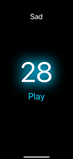

# BeatBuddies

The intent of this app is to bring people together by sharing music through a gamified experience. Users will be matched randomly from their friends list, and given a theme that they will need to choose a song to match. After both users choose a song, they will then rate each others song choice on a scale of 1-5 stars. 

Prerequisites
Before starting, ensure you have the following installed on your machine:
1) Node.js (version 16 or later):
  Install from Node.js official site.
2) npm (comes with Node.js).
3) Watchman (if you need to resolve file watcher issues on macOS):
  (Install with Homebrew): brew install watchman

Setup Instructions - Starting Expo Go
1) Clone the Repository
  git clone https://github.com/<your-repo-name>.git
  cd <your-repo-name>
2) Install Dependencies Install all required dependencies using:
  npm install
3) Fix TypeScript Prompt If prompted to install TypeScript dependencies, run:
  npm install typescript @types/react
4) Start the Project Start the project using Expo:
  npx expo start
5) Run on Expo Go
   Open the Expo Go app on your mobile device.
  Scan the QR code shown in your terminal or browser to load the app (QR code should appear after running 'npx expo start'.

